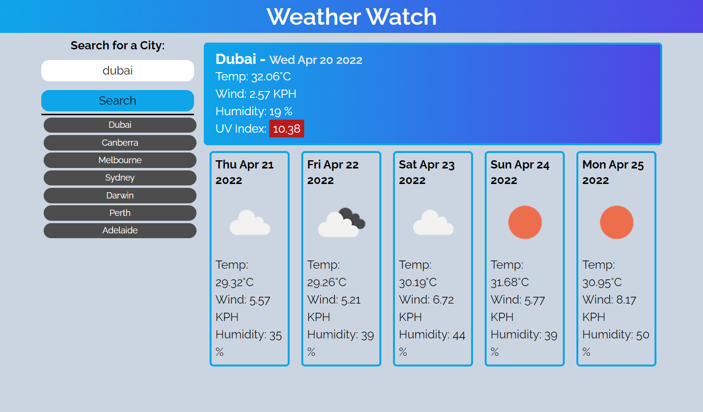

# Weather Watch (Weather Dashboard)

## Goal
Design and develop a weather dashboard application so a traveler can search multiple cities.

---
## Website URL
https://daman29.github.io/Weather-Dashboard/

Link above takes you to the webpage.

---

## Description

- Utilised Tailwind CSS for design of webpage
- Utilised OpenweatherAPI to return weather data from search
- Search bar to allow user to search for a location to get weather data
- Stores previous searches in the history
- Search history allows user to quickly choose an older search and return the weather
- Color coded UV index to easily allow user to see the impact
- Search history is persistent
- Icon in the 5 day forecast to easily see the upcoming week

---
## Damneet's Weather Dashboard
Below is the screen capture of the webpage.

---
